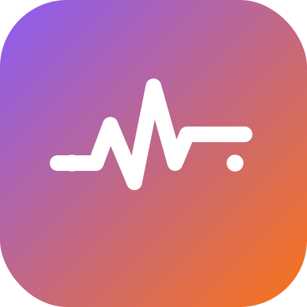

# Recovery

A single-file exercise recovery journal that runs entirely in your browser — no server, no account, no build step. Just open `index.html`.

## Features

- **Program**: exercises organized by 🦵 Leg, ✋️ Hand/Arm, and 🧘 Full Body/Balance — pick from a 60-exercise built-in library or add your own, each with optional instructions, video link, and photos
- **Log**: check off exercises done, with sets, reps, pain level (0–10), and assistance level (Assisted/Partial/Independent)
- **Progress**: charts for reps over time, pain trend, and independence progress, plus a full session history
- **Schedule**: an interactive weekly planner — today's program highlighted, weekly completion tracker, per-day exercise lists (automatic or fully customizable), and an editable weekly rhythm
- **Exercise demos**: a "How to do it" panel per exercise, with real video demonstrations for a curated set and YouTube search fallback for the rest
- **Export**: CSV history and a printable HTML report for your physical therapist, plus full JSON backup/restore
- **Dark theme**, offline-first, installable as a PWA

## Getting started

1. Download `index.html` and open it in any modern browser (double-click, or drag it into a browser window).
2. Your data is saved locally in that browser via `localStorage` — nothing leaves your machine.

## Data & privacy

All data stays in your browser's local storage. Clearing your browser's site data for local files will erase it — use **Settings → Export** (CSV, HTML report, or JSON backup) regularly to keep a copy.

## Disclaimer

This app is a tracking tool, not a medical device. Exercise instructions are generic reference text, not medically verified. Always confirm your exercise program and technique with your doctor or physical therapist.

## Tech

Plain HTML/CSS/JavaScript, zero dependencies, zero build step. `build.ps1` / `build.bat` produce a single-file distributable in `dist/` with the icon inlined.
